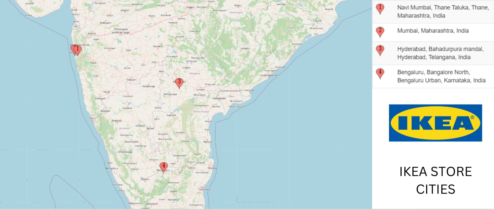
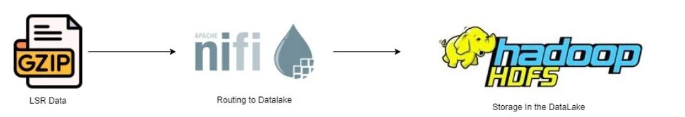
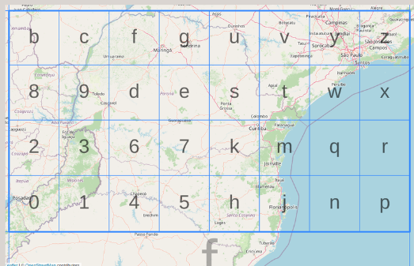

+++
title = "Jio - IKEA Notifications PoC"
date = "2024-04-01"
+++

During my time as a data engineer at Jio Platforms, we developed a proof of concept (PoC) pipeline for IKEA. In early 2024, IKEA had four physical stores in India and wanted to boost walk-in sales by using Jio's telecom customer data. Their goal was to provide discount coupons to customers entering or nearby the stores. We initiated this by using 4G and 5G Label Switch Router (LSR) data to determine live customer locations.
<!--more-->

# Jio - IKEA Notifications PoC
During my time as a data engineer at Jio Platforms, an interesting streaming requirement emerged. We needed to develop a proof of concept (PoC) pipeline and workflow for a unique client: IKEA.

In early 2024, IKEA had only five physical stores in pan-India and sought to increase their walk-in sales. They aimed to utilize telecom customer data from Jio to achieve this goal by providing discount coupons to customers who entered the stores or were nearby.

These were the only objectives given to us. To begin our work, we used the 4G and 5G Label Switch Router (LSR) data as the foundation for determining live customer locations.

## LSR (Label Switch Router) Data - 
When a Jio customer connects using his sim to the internet, data requests (like loading a webpage or streaming) are routed through Jio’s network. LSRs assign labels to these data packets, ensuring they reach their destination faster.
- Directs data traffic to make data move faster in a network
- Crucial for large companies like telecom providers to deliver services faster and more reliably

Real-time streaming data is collected from across India for more than 400 million users, covering both 4G and 5G service types stored in HDFS locations and servers. LSR data provides valuable metrics, including:

- Source and destination of data packets
- Service type (4G/5G)
- Packet routing information
- Performance and monitoring data
- Packet loss information
- Traffic type and bandwidth requirements

An extremely simplified version of the flow is represented below for this data collection.

## Partitioning Strategies

Now based on the LSR data collection and scale, the following partitioning strategy is implemented for the data:

Data is partitioned according to:
- Hour
- Date
- 22 Clusters, which generally correspond to states. For example:
  - The Mumbai cluster includes Maharashtra and Goa due to a high volume of routing data.
  - Uttar Pradesh is divided into UP West and UP East.

Partitioning and bucketing strategies are applied to manage and process data efficiently.

## Geo-hash Location Determination for Jio Users
Due to the following data partitioning strategies, we can concentrate on relevant clusters instead of the entire data set. This allows us to focus specifically on the Mumbai, Karnataka, and Andhra Pradesh clusters. Additionally, we will only access data from the latest hourly partitions, as customers who have recently arrived near the store locations are most relevant to this use case.

To geolocate more accurately, we use the open-source technique called geo-hashing, utilizing longitude and latitude.

- LSR data for each IMSI includes longitude and latitude
- To obtain the Geohash, the user provides an address to be geocoded, or latitude and longitude coordinates
- Geohash system is used for efficient location encoding

## Incentives for the Use Case
- Time-sensitive deals and offers for telecom subscribers
- Monitor in-store sales increases
- Provide additional incentives to nearby users
- Potential revenue generation increase for partnering companies